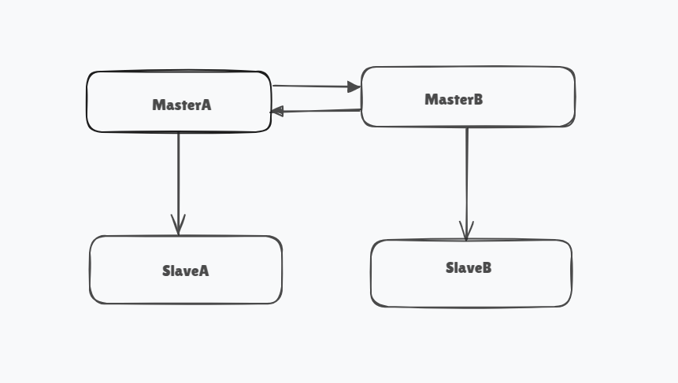

# Approach\_Paper-**PostgreSQL  Multi Master-Slave Replication**

# 

[**1\. Objective	]

[**2\. Proposed Solutions	]

[Approach: Logical Replication with pglogical	]

[**3\. Approach 1: Details	]

[3.1 Architecture Diagram ]

[3.2 Description ]

[Implementation Steps: ]

[Pros:	]

[Cons:	]

[3.3 Pre-requisites	]

[3.3.1 Hardware Requirements ]

[3.3.2 Software Requirements ]

[3.3.3 Networking Requirements ]

# 

# 

# 

## 

## **1\. Objective** 

The objective of this project is to set up and configure 4 PostgreSQL containers:

* **MasterA** and **MasterB**: Primary nodes to handle read/write operations.  
* **SlaveA** and **SlaveB**: Replicas to handle read-only operations and ensure high availability.

**Replication Goals:**

* Queries written on **MasterA** should replicate and be readable from all containers.  
* Queries written on **MasterB** should replicate and be readable from all containers.

## **2\. Proposed Solutions** 

### **Approach 1: Logical Replication with pglogical** 

* Use `pglogical` extension to configure bi-directional replication.  
* Enable publication/subscription between MasterA, MasterB, and their respective slaves.  
* Data inserted on one master will be automatically replicated to all other nodes.

### **Approach 2: Physical Replication with Cascading**

* Set up streaming replication for MasterA to SlaveA and MasterB to SlaveB.  
* Configure cascading replication so that any data change on MasterA/MasterB replicates downstream.

### **Chosen Approach: Approach 1**

* **Why Chosen:** Logical replication via `pglogical` supports bidirectional replication, allowing real-time updates to propagate seamlessly across all containers.

---
## 

## **3\. Approach 1: Details** 

### 

### **3.1 Architecture Diagram** 

#### **Implementation Steps:** 

1. Create and configure containers using Podman for MasterA, MasterB, SlaveA, and SlaveB.  
2. Enable `pglogical` extension in PostgreSQL for logical replication.  
3. Set up publications on MasterA and MasterB.  
4. Create subscriptions on SlaveA and SlaveB to receive changes.  
5. Verify replication of tables, data, and DDL changes.

#### **Pros:** 

* Supports multi-master replication.  
* Minimal latency for real-time data sync.  
* Easier to manage and configure.

#### **Cons:** 

* Higher network traffic due to bidirectional replication.  
* Requires careful conflict resolution for concurrent writes.

### **3.3 Pre-requisites** 

#### **3.3.1 Hardware Requirements** 

* CPU: 4 cores  
* RAM: 8 GB  
* Storage: 100 GB

#### **3.3.2 Software Requirements** 
* Podman: v4.5+  
* PostgreSQL: v16+  
* pglogical: v3.4  
* Operating System: Ubuntu 22.04 LTS

#### **3.3.3 Networking Requirements** 

* Network A: 192.168.100.0/24  
* Network B: 192.168.200.0/24  
* Ensure containers can communicate across subnets.

---

