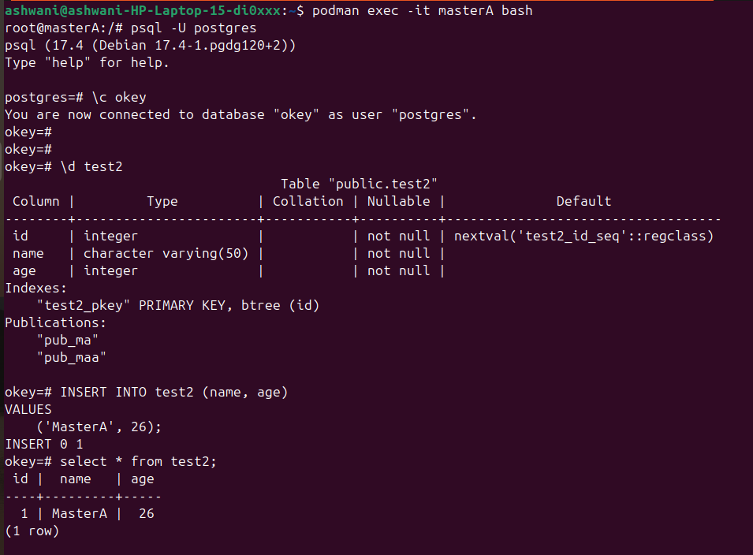
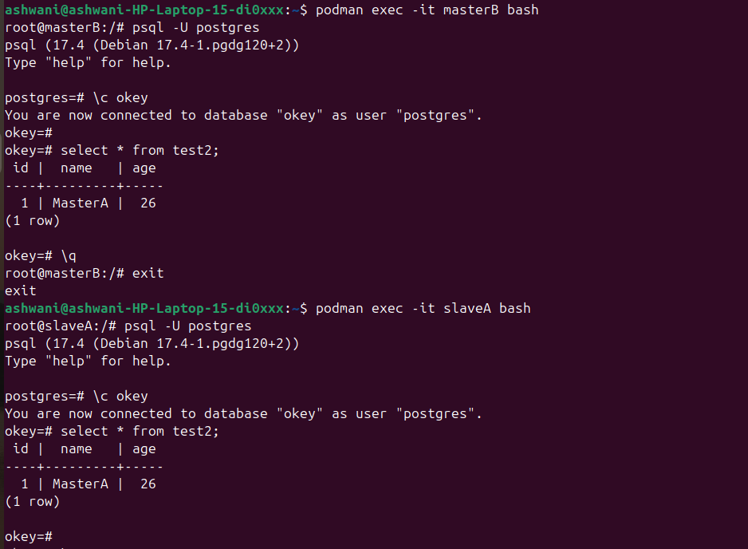
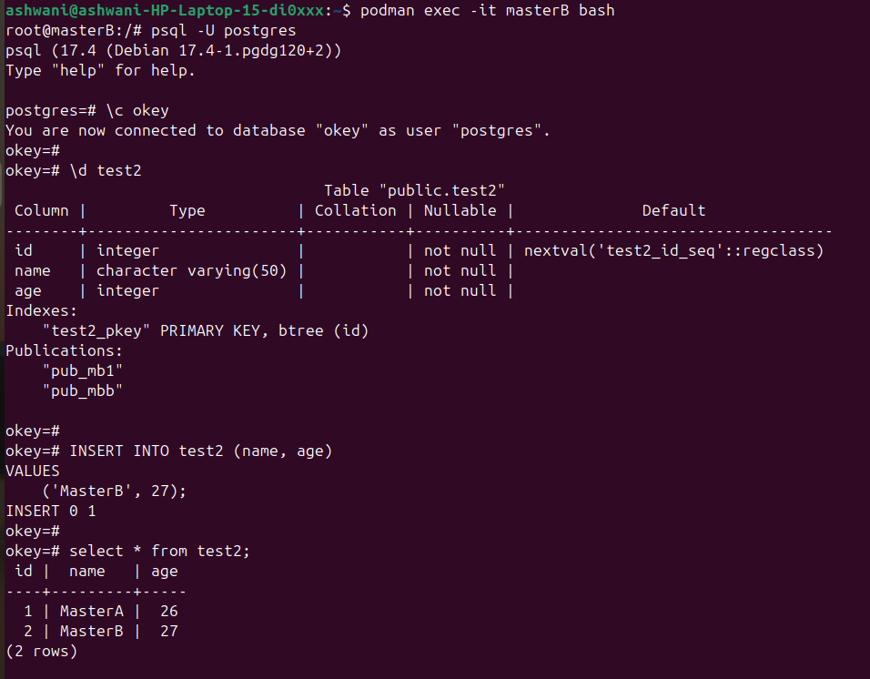
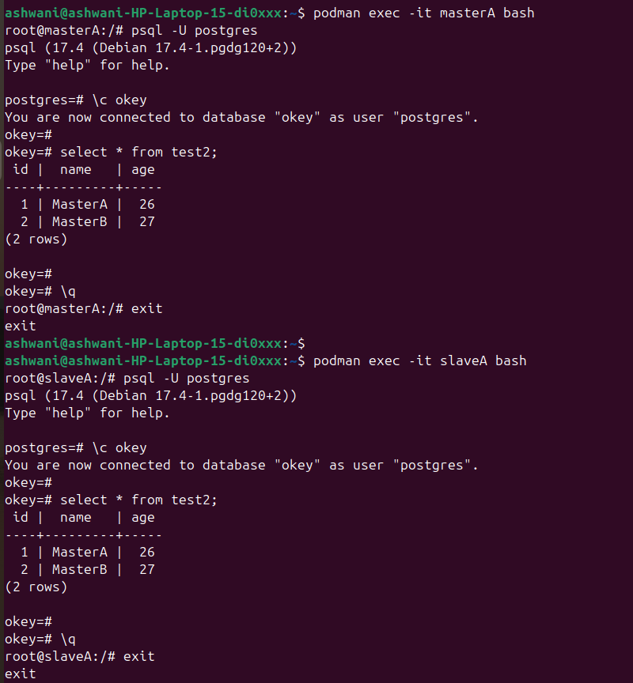

#    ** TEST CASES \- PostgreSQL Multi Master-Slave Replication**

#  

| Submitted By | Ashwani Prajapati |
| :---- | :---- |
| Submitted To | Rashmi Chaudhary |
| Test Case Version | Version 1 |
| Reviewer  Name | Rashmi Chaudhary |

**Goal**  
       
Goal Set up 4 PostgreSQL containers (MasterA, MasterB, SlaveA, and SlaveB) and configure replication between them. Queries written on MasterA should replicate and be readable from all containers. Similarly, queries written on MasterB should replicate and be readable from all containers.

**Table of Contents**

**[Test Environment :	3]

[**TC1: Replication from MasterA to All Containers ]

[**TC2: Replication from MasterB to All Containers ]

[**TC3: Query Verification on All Containers ]

[**TC4: Failure Recovery and Replication Resilience ]

[**NFR Test Cases:**]

## Test Environment :  

**Host System**: Linux-based OS (Ubuntu 24.04 )

**Container Runtime**: Podman

**PostgreSQL Version**: 17

**Storage**: Volumes mounted at `/home/ashwani/mydir`

**Networking**: Separate networks for PostgreSQL instances

  

## TC1: Data Replication from MasterA to All Containers {#tc1:-data-replication-from-mastera-to-all-containers}

| Scenario |  | Verify that data inserted into MasterA is replicated and readable from MasterB, SlaveA, and SlaveB. |  |  |  |
| :---- | ----- | :---- | :---- | :---- | :---- |
| **Remarks:**  |  | Ensure replication is configured correctly. |  |  |  |
| **Given** |  | MasterA is running and configured with a publication. \- SlaveA, SlaveB, and MasterB are subscribed to MasterA. |  |  |  |
| **When** |  | A record is inserted into MasterA. |  |  |  |
| **Then** |  | The same record is available in MasterB, SlaveA, and SlaveB using SELECT queries. |  |  |  |
| **Test Run** |  | **Date** |  | **Result** |  |

## 

## TC2: Data Replication from MasterB to All Containers 

| Scenario |  | Verify that data inserted into MasterB is replicated and readable from MasterA, SlaveA, and SlaveB. |  |  |  |
| :---- | ----- | :---- | :---- | :---- | :---- |
| **Remarks:**  |  | Ensure replication is configured correctly. |  |  |  |
| **Given** |  | MasterB is running and configured with a publication. \- SlaveA, SlaveB, and MasterA are subscribed to MasterB. |  |  |  |
| **When** |  | A record is inserted into MasterB. |  |  |  |
| **Then** |  | The same record is available in MasterA, SlaveA, and SlaveB using SELECT queries. |  |  |  |
| **Test Run** |  | **Date** |  | **Result** | Pending/Pass/Fail |

### 

## 

## 

## 

## **TC3: SELECT Query Verification on All Containers** 
| Scenario |  | Validate that SELECT queries can read data written by MasterA and MasterB on all containers. |  |  |  |
| :---- | ----- | :---- | :---- | :---- | :---- |
| **Remarks:**  |  | Verify that data consistency is maintained. |  |  |  |
| **Given** |  | Data is inserted into MasterA and MasterB. |  |  |  |
| **When** |  | SELECT queries are executed on MasterA, MasterB, SlaveA, and SlaveB. |  |  |  |
| **Then** |  | The correct data is returned from all containers. |  |  |  |
| **Test Run** |  | **Date** | 12-01-2025 | **Result** | Pass |

## 

## **TC4: Failure Recovery and Replication Resilience** 

| Scenario |  | Verify that replication resumes and data remains consistent after failure recovery. |  |  |  |
| :---- | ----- | :---- | :---- | :---- | :---- |
| **Remarks:**  |  | Test different failure scenarios. |  |  |  |
| **Given** |  | Any Master or Slave is down and replication is interrupted. |  |  |  |
| **When** |  | The container is restarted and replication resumes. |  |  |  |
| **Then** |  | Data remains consistent and updated on all containers. |  |  |  |
| **Test Run** |  | **Date** | 12-01-2025 | **Result** | Pass |
| Testing outputs  (paste your output/snapshots here ) |  |  |  |  |  |

### 

